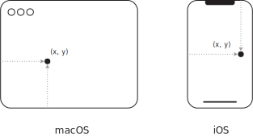
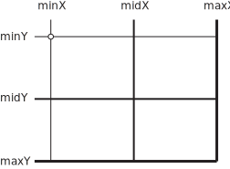

# Geometry in Quartz 2D

Every view in an iOS or macOS app has a frame represented by a `CGRect` value.

## The drawing system


- A `CGFloat` represents a scalar quantity.
- A `CGPoint` represents a location in a two-dimensional coordinate system and is defined by x and y scalar components.
- A `CGVecto` represents a change in position in 2D space and is defined by dx and dy scalar components.
- A `CGSize` represents the extent of a figure in 2D space and is defined by width and height scalar components.
- A `CGRect` represents a rectangle and is defined by an origin point (CGPoint) and a size (CGSize).

```swift
import CoreGraphics

let float: CGFloat = 1.0
let point = CGPoint(x: 1.0, y: 2.0)
let vector = CGVector(dx: 4.0, dy: 3.0)
let size = CGSize(width: 4.0, height: 3.0)
var rectangle = CGRect(origin: point, size: size)
```

>💡 `CGVector` isn’t widely used in view programming; instead, `CGSize` values are typically used to express positional vectors. Unfortunately, this can result in awkward semantics, because sizes may have negative `width` and / or `height` components (in which case a rectangle is extended in the opposite direction along that dimension).

## Coordinate System

On iOS, the origin is located at the top-left corner of a window, so x and y values increase as they move down and to the right. macOS, by default, orients (0, 0) at the bottom left corner of a window, such that y values increase as they move up.



## Properties

you can access the member values of geometric types directly through their stored properties:

```swift
point.x // 1.0
point.y // 2.0

size.width // 4.0
size.height // 3.0

rectangle.origin // {x 1 y 2}
rectangle.size // {w 4 h 3}
```

You can mutate variables by reassignment or by using mutating operators like `*=` and `+=`:

```swift
var mutableRectangle = rectangle // {x 1 y 2 w 4 h 3}
mutableRectangle.origin.x = 7.0
mutableRectangle.size.width *= 2.0
mutableRectangle.size.height += 3.0
mutableRectangle // {x 7 y 2 w 8 h 6}
```

For convenience, rectangles also expose width and height as top-level, computed properties; (x and y coordinates must be accessed through the intermediary origin):

```swift
rectangle.origin.x
rectangle.origin.y
rectangle.width
rectangle.height
```

>💡 However, you can’t use these convenience accessors to change the underlying rectangle like in the preceding example:

```swift
mutableRectangle.width *= 2.0 // {x 1 y 2 w 8 h 3} // ⚠️ Left side of mutating operator isn't mutable: 'width' is a get-only property
```

### Minimum, Median, and Maximum Values

Although a rectangle can be fully described by a location (CGPoint) and an extent (CGSize), that’s just one side of the story.

For the other 3 sides, use the built-in convenience properties to get the minimum (min), median (mid), and maximum (max) values in the x and y dimensions:

```swift
rectangle.minX // 1.0
rectangle.midX // 3.0
rectangle.maxX // 5.0

rectangle.minY // 2.0
rectangle.midY // 3.5
rectangle.maxY // 5.0
```

Points, sizes, and rectangles each have a zero property, which defines the identity value for each respective type:

```swift
CGPoint.zero // {x 0 y 0}
CGSize.zero // {w 0 h 0}
CGRect.zero // {x 0 y 0 w 0 h 0}
```

CGRect has two additional special values: infinite and null:

```swift
CGRect.infinite // {x -∞ y -∞ w +∞ h +∞}
CGRect.null // {x +∞ y +∞ w 0 h 0}
```

CGRect.null is conceptually similar to NSNotFound, in that it represents the absence of an expected value, and does so using the largest representable number to exclude all other values.

CGRect.infinite has even more interesting properties, as it intersects with all points and rectangles, contains all rectangles, and its union with any rectangle is itself.

```swift
CGRect.infinite.contains(any point) // true
CGRect.infinite.intersects(any other rectangle) // true
CGRect.infinite.union(any other rectangle) // CGRect.infinite
```

Use isInfinite to determine whether a rectangle is, indeed, infinite.

```swift
CGRect.infinite.isInfinite // true
```

But to fully appreciate why these values exist and how they’re used, let’s talk about geometric relationships:



>⚡ More info in [NSHipster](https://nshipster.com/cggeometry/)