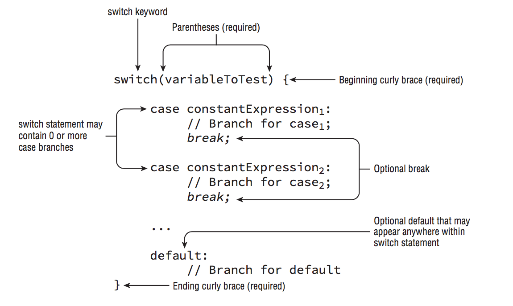

# Switch



Flow:

1. The code will evaluate the target variable (in runtime).
2. If the target variable is not found it will jump to the default block.
3. Also, the default is executed if there is no break statement at the end of the preceding case block.
4. Then it'll execute all of the proceeding case statements in order until it finds a break statement or finishes the structure.

Eg.:

```Java
int dayOfWeek = 5;
  switch(dayOfWeek) {
    default:
      System.out.println("Weekday");
      break;
    case 0:
      System.out.println("Sunday");
      break;
    case 6:
      System.out.println("Saturday");
      break;
}
//Weekday
```

There is no requirement that the case or default statements be in a particular order, unless you are going to have pathways that reach multiple sections of the switch block in a single execution.

To illustrate both of the preceding points, consider the following variation:

```Java
int dayOfWeek = 5;
  switch(dayOfWeek) {
    case 0:
      System.out.println("Sunday");
    default:
      System.out.println("Weekday");
    case 6:
      System.out.println("Saturday");
    break;
}
// Weekday
// Saturday
```

This code looks a lot like the previous example except two of the break statements have been removed and the order has been changed. This means that for the given value of  dayOfWeek, 5, **the code will jump to the default block and then execute all of the proceeding case statements in order until it finds a break statement or finishes the structure**.

## Data types supported

Data types supported by switch statements include the following:

* int and Integer
* byte and Byte
* short and Short
* char and Character int and Integer String
* String
* enum values

For the exam, we recommend you memorize this list. Note that **boolean** and **long**, and their associated wrapper classes, are not supported by switch statements.

The values in each case statement must be compile-time constant values of the same data type as the switch value. This means you can use only:

* Literals
* enum constants
* final constant variables of the same data type.

(No se pueden usar variables para los casos si no han sido previamente declaradas como final e inicializadas en la misma linia. Ex: `case variable:`  error de compilación.)