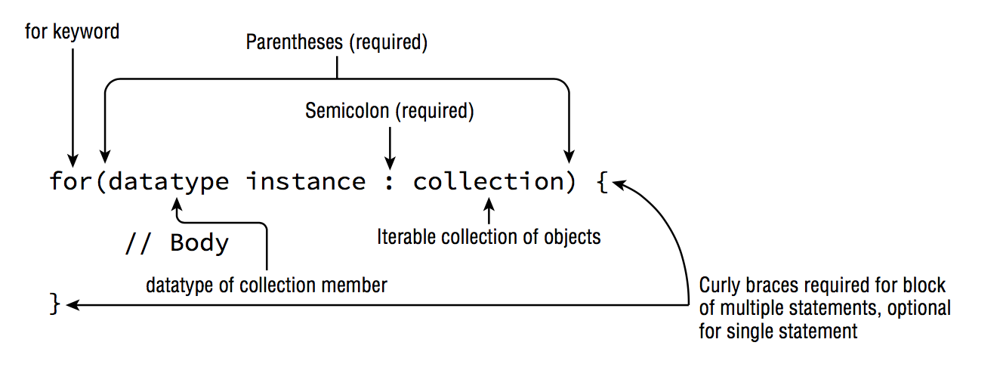

# For statement

Starting in Java 5.0, there are now two types of for statements:

## 1. Basic for Statement


* Note that each section is separated by a semicolon.
* The initialization and update sections may contain multiple statements, separated by commas.
* Variables declared in the initialization block of a for loop have limited scope and are only accessible within the for loop.

Eg.:

```Java
for(long y = 0, x = 4; x < 5 && y < 10; x++, y++) {
  System.out.print(y + " ");
}
System.out.print(x); // DOES NOT COMPILE
```

```Java
// Infinite Loop
for( ; ; ) {
  System.out.println("Hello World");
}
```

```Java
// Multiple Terms 
int x = 0;
for(long y = 0, z = 4; x < 5 && y < 10; x++, y++) {
  System.out.print(y + " ");
}
System.out.print(x);
```

```Java
int x = 0;
for(long y = 0, x = 4; x < 5 && y < 10; x++, y++) {
// ERROR: duplicate variable declaration of x
// outside the for x is declared as int
// Inside the for, x is declared as long
  System.out.print(x + " ");
}
```

```Java
for(long y = 0, int x = 4; x < 5 && y<10; x++, y++) { 
// DOES NOT COMPILE
// The variables in the initialization block must all be of the same type.
  System.out.print(x + " ");
}
```

## for-each Statement

Designed for iterating over arrays and Collection objects.

