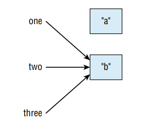

# Destroying Objects

## The heap

All Java objects are stored in your program memory’s heap. The heap, which is also referred to as the free store, represents a large pool of unused memory allocated to your Java application. The heap may be quite large, depending on your environment, but there is always a limit to its size. If your program keeps instantiating objects and leaving them on the heap, eventually it will run out of memory.

## Garbage Collection

Garbage collection refers to the process of automatically freeing memory on the heap by deleting objects that are no longer reachable in your program.

You need to know that `System.gc()` is not guaranteed to run, and you should be able to recognize when objects become eligible for garbage collection.

An object will remain on the heap until it is no longer reachable. An object is no longer reachable when one of two situations occurs:

* The object no longer has any references pointing to it.
* All references to the object have gone out of scope.

It is the object that gets garbage collected, no its reference.

## Example

Look at this code and see if you can figure out when each object first becomes eligible for garbage collection:

```java
public class Scope {
    public static void main(String[] args) {
        String one, two;
        one = new String("a");
        two = new String("b");
        one = two;
        String three = one;
        one = null;
    }
}
```



* On line 6, we got rid of the only arrow pointing to "a", making that object eligible for garbage collection.
* "b" has arrows pointing to it until it goes out of scope. This means "b" doesn’t go out of scope until the end of the method on line 9.

## finalize()

Java allows objects to implement a method called `finalize()` that might get called. This method gets called if the garbage collector tries to collect the object. If the garbage collector doesn’t run, the method doesn’t get called. If the garbage collector fails to collect the object and tries to run it again later, the method doesn’t get called a second time.

For the exam just keep in mind that it might not get called and that it definitely won’t be called twice.
The lesson is that the `finalize()` call could run zero or one time.

example:

```Java
public class Finalizer {
private static List objects = new ArrayList();
protected void finalize() {
objects.add(this); // Don't do this
} }
```

Remember, `finalize()` is only run when the object is eligible for garbage collection. The problem here is that by the end of the method, the object is no longer eligible for garbage collection because a static variable is referring to it and static variables stay in scope until the program ends. Java is smart enough to realize this and aborts the attempt to throw out the object.

Now suppose later in the program objects is set to null. Oh, good, we can finally remove the object from memory. Java remembers already running `finalize()` on this object and will not do so again. The lesson is that the `finalize()` call could run zero or one time. This is the exact same lesson as the simple example  that’s why it’s so easy to remember.
