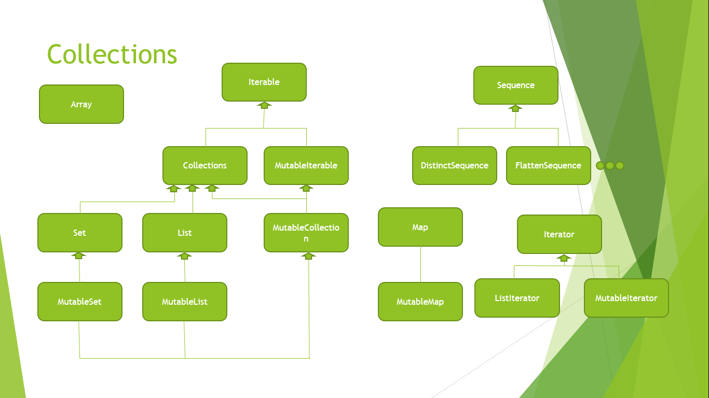

# Kotlin Kollections

All Java collections are available for Kotlin applications.



Although we can just use Java collections, Kotlin provides a good set of native interfaces you will want to use:

* **Iterable**: The parent class. Any classes that inherit from this interface represent a sequence of elements we can iterate over.

* **MutableIterable**: Iterables that support removing items during iteration.

* **Collection**: This class represents a generic collection of elements. We get access to functions that return the size of the collection, whether the collection is empty, contains an item or a set of items. All the methods for this kind of collections are only to request data, because collections are immutable.

* **MutableCollection**: a Collection that supports adding and removing elements. It provides extra functions such as add, remove or clear among others.

* **List**: Probably the most used collection. It represents a generic ordered collection of elements. As it’s ordered, we can request an item by its position, using the get function.

* **MutableList**: a List that supports adding and removing elements.

* **Set**: an unordered collection of elements that doesn’t support duplicate elements.

* **MutableSet**: a Set that supports adding and removing elements.

* **Map**: a collection of key-value pairs. The keys in a map are unique, which means we cannot have two pairs with the same key in a map.

* **MutableMap**: a Map that supports adding and removing elements.

## Constructor and methods

### Constructor

Kotlin does not have dedicated syntax constructs for creating lists or sets. Use methods from the standard library, such as `listOf()`, `mutableListOf()`, `setOf()`, `mutableSetOf()`. Map creation in NOT performance-critical code can be accomplished with a simple idiom: `mapOf(a to b, c to d)`.

```Kotlin
// Type anotation: for constructor
val map : MutableMap<Int, MutableList<String>>
```

```Kotlin
// Initialization
val mutableListNames: MutableList<String> = mutableListOf<String>("Josh", "Kene", "Sanya")
val listNames: mutableListOf<String>("Josh", "kene", "Sanya")
val listTwo = listOf("One", "two")
```

```Kotlin
// Declaration of an empty List
val emptyList: List<String> = emptyList<String>()
val map = mutableMapOf<Int, String>()
```

### The Collection interface

`size`: this property returns the size of the collection.

`isEmpty()`: returns true if the collection is empty or false otherwise.

`contains(element: E)`: returns true if the element specified in the argument is present in the collection.

`containsAll(element: Collection<E>)`: returns true if the element in the collection passed as argument is present in the collection.

### The MutableCollection Interface

`add(element: E)`: adds the element passed as an argument to the collection and returns true if successful or false if the collection does not support duplicates and the element is already present.

`remove(element: E)`: removes the element passed as an argument from the collection. Returns true if successful or false if it was not present in the collection.

`addAll(elements: Collection<E>)`: adds all the elements in the collection passed as arguments to the collection. Returns true if successful or false if nothing was added.

`removeAll(elements: Collection<E>)`: removes all of the elements present in the collection passed as arguments. Returns true if successful or false if nothing was removed.

`retainAll(elements: Collection<E>)`: retains only the elements present in the collections passed as arguments. Returns true if successful or false if nothing was retained.

`clear()`: removes all elements from this collection.

### inmutable Methods

`get(index: Int)`: a function operator that returns the element at the specified index.

`indexOf(element: E)`: returns the index of the first occurrence of the element passed as an argument in the list, or -1 if none is found.

`lastIndexOf(element: E)`: returns the index of the last occurrence of the element passed as an argument in the list, or -1 if none is found.

`listIterator()`: returns a list iterator over the elements in the list.

`subList(fromIndex: Int, toIndex: Int)`: returns a list that contains the portion of the list between the specified start and end indices.

### mutable Methods

`set(index: Int, element: E)`: substitutes an element in the list with another element. This returns the element previously at the specified position.

`add(index: Int, element: E)`: inserts an element at the specified index.

`removeAt(index: Int)`: gets rid of the element at a particular index.