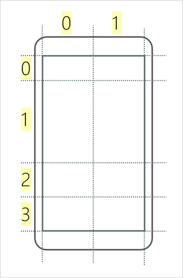
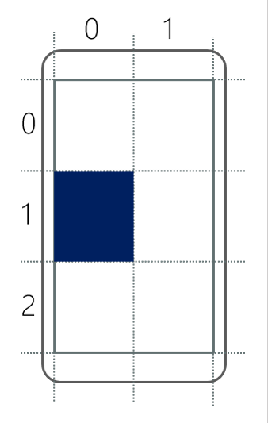
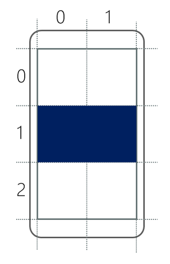

# Grid Layout

The Grid layout panel is the choice for UIs that need both rows and columns. You place views in the cells that are created from the intersection of the rows and columns. The rows and columns can be different sizes, or they can be set to automatically adapt to the size of the children placed inside them. Child views can occupy a single cell or span across many cells. This flexibility makes Grid a good choice for the root layout panel for many apps.

## How to define the rows and columns

When you're creating a Grid, you need to define each row and column individually. Every Grid has a collection of `RowDefinition` and `ColumnDefinition` objects that define the shape of the grid.

`RowDefinition` has a property called `Height` and `ColumnDefinition` has a property called `Width`. You use these properties to set the height of a row and the width of a column.

The data type for Width and Height is `GridLength`. This type contains two properties: `GridUnitType` and `Value`.

### GridUnitType

You can set the property GridUnitType to one of these values:

- **Absolute**: Absolute specifies that the row or column will be fixed in size. You use the Value property to indicate what the size will be.

    ```xml
    <RowDefinition Height="100" />
    ```

- **Auto**: Auto will automatically size the row or column to fit your child views. The Grid will scan all child views in that row or column, select the largest view, and then make the row or column large enough to fit that child.

    ```xml
    <RowDefinition Height="Auto" />
    ```

- **Star**: Star gives you proportional sizing. The size is determined by the total available space and ratio that each row or column asks for.

    ```xml
    <RowDefinition Height="2*" />
    ```

    In XAML, you use the `*` symbol to represent star sizing. You combine the value and the * in a single string and a type converter creates the GridLength for you. Here's the same example in XAML.

## Add rows and columns

You add them by using the `RowDefinitions` and `ColumnDefinitions` collection properties of the Grid.

```xml
<Grid>
    <Grid.RowDefinitions>
        <RowDefinition Height="100" />
        <RowDefinition Height="Auto" />
        <RowDefinition Height="1*" />
        <RowDefinition Height="2*" />
    </Grid.RowDefinitions>
    ...
</Grid>
```

At runtime, this XAML will produce a Grid with four rows. The first row will have a fixed height of 100 device units. The second row will have the height of the tallest view in the row. The third and fourth rows use star sizing, which means they'll take the remaining available space and divide it proportionally based on their Value multiplier. Because the third row is `1*` and the fourth row is `2*`, the fourth row will be twice the height of the third row.

## Row and column default size

The default for rows and columns is `1*` size.

```xml
<Grid>
    <Grid.RowDefinitions>
        <RowDefinition />
        <RowDefinition />
        <RowDefinition />
    </Grid.RowDefinitions>
    <Grid.ColumnDefinitions>
        <ColumnDefinition />
        <ColumnDefinition />
    </Grid.ColumnDefinitions>
    ...
</Grid>
```

Because none of the rows or columns have sizes specified, 1* will be applied to all of them. At runtime, this configuration will create a Grid that's uniform, meaning all rows will be the same height and all columns will be the same width.

## How to add views to a Grid

When we add a view to a Grid, we add it to a specific cell. You use a combination of a row number and a column number to identify a cell.



For example, if we wanted to add a view to the first second row and first column:

```xml
<Grid>
    <Grid.RowDefinitions>
        <RowDefinition />
        <RowDefinition />
        <RowDefinition />
    </Grid.RowDefinitions>
    <Grid.ColumnDefinitions>
        <ColumnDefinition />
        <ColumnDefinition />
    </Grid.ColumnDefinitions>

    <BoxView Grid.Row="1" Grid.Column="0" BackgroundColor="Navy" />
</Grid>
```

When the Grid is ready to position the view, it will check the collection to see if there's a key called `Grid.Row`. If there is, the Grid will use the value to position the view.



## How to make a view span multiple rows or columns

The properties `Grid.RowSpan` and `Grid.ColumnSpan` specify how many rows or columns the view should occupy.

```xml
<Grid>
    <Grid.RowDefinitions>
        <RowDefinition />
        <RowDefinition />
        <RowDefinition />
    </Grid.RowDefinitions>
    <Grid.ColumnDefinitions>
        <ColumnDefinition />
        <ColumnDefinition />
    </Grid.ColumnDefinitions>

    <BoxView Grid.Row="1" Grid.Column="0" Grid.ColumnSpan="2" BackgroundColor="Navy" />
</Grid>
```



## Final Example


```xml
<?xml version="1.0" encoding="utf-8" ?>
<ContentPage xmlns="http://xamarin.com/schemas/2014/forms"
             xmlns:x="http://schemas.microsoft.com/winfx/2009/xaml"
             xmlns:local="clr-namespace:TipCalculator"
             x:Class="TipCalculator.MainPage"
             Padding="40">

    <Grid>

        <Grid.RowDefinitions>
            <RowDefinition Height="Auto" />
            <RowDefinition Height="Auto" />
            <RowDefinition Height="Auto" />
            <RowDefinition Height="*" />
            <RowDefinition Height="Auto" />
            <RowDefinition Height="Auto" />
            <RowDefinition Height="Auto" />
        </Grid.RowDefinitions>

        <Grid.ColumnDefinitions>
            <ColumnDefinition Width="*" />
            <ColumnDefinition Width="*" />
        </Grid.ColumnDefinitions>

        <Label Grid.Row="0" Grid.Column="0" Text="Bill" VerticalOptions="Center" />
        <Entry Grid.Row="0" Grid.Column="1" x:Name="billInput" Placeholder="Enter Amount" Keyboard="Numeric" />

        <Label Grid.Row="1" Grid.Column="0" Text="Tip" />
        <Label Grid.Row="1" Grid.Column="1" x:Name="tipOutput" Text="0.00" />

        <Label Grid.Row="2" Grid.Column="0" Text="Total" />
        <Label Grid.Row="2" Grid.Column="1" x:Name="totalOutput" Text="0.00" />

        <Label Grid.Row="3" Grid.Column="0" VerticalOptions="End" HorizontalOptions="Start" Text="Tip Percentage" />
        <Label Grid.Row="3" Grid.Column="1" VerticalOptions="End" HorizontalOptions="End" x:Name="tipPercent" Text="15%" />
        <Slider Grid.Row="4" Grid.Column="0" Grid.ColumnSpan="2" x:Name="tipPercentSlider" Minimum="0" Maximum="100" Value="15" />

        <Button Grid.Row="5" Grid.Column="0" Text="15%" Clicked="OnNormalTip" />
        <Button Grid.Row="5" Grid.Column="1" Text="20%" Clicked="OnGenerousTip" />

        <Button Grid.Row="6" Grid.Column="0" x:Name="roundDown" Text="Round Down" />
        <Button Grid.Row="6" Grid.Column="1" x:Name="roundUp"   Text="Round Up" />

    </Grid>

</ContentPage>
```