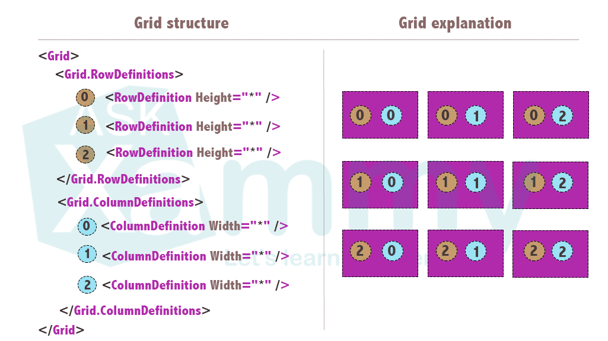
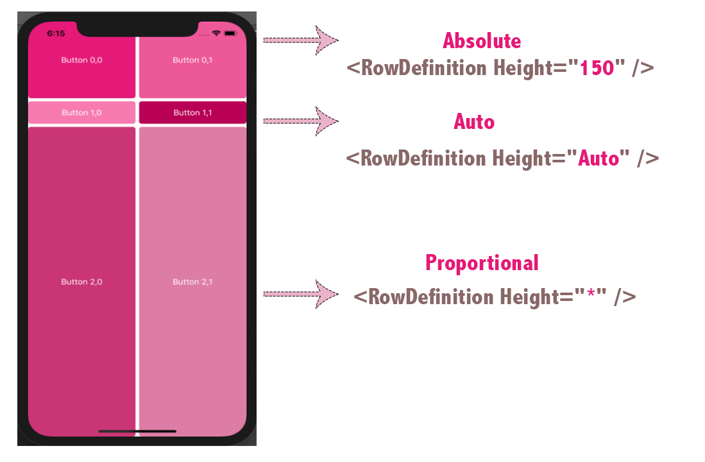
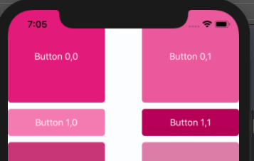

# Grid



## Filas

Para crear una fila (Row), solo tienes que agregar dentro de la etiqueta `<Grid.RowDefinitions>` tantas filas como desees y agregar la propiedad `height`. Con la siguiente etiqueta:`<RowDefinition />`.

```cs
<Grid.RowDefinitions>
    <RowDefinition  />
</Grid.RowDefinitions>
```

## Columnas

Para crear una columna (Column), solo tienes que agregar dentro de la etiqueta `<Grid.ColumnDefinitions>` tantas columnas como desees y agregar la propiedad `width`. Con la siguiente etiqueta: `<RowDefinition />`.

```cs
<Grid.ColumnDefinitions>
    <ColumnDefinition />
</Grid.ColumnDefinitions>
```

## Altura y Anchura



Tres opciones:

- **Auto**: Se ajusta al contenido de la fila o columna.
- **Proportional (*)**: divide el tamaño de las columnas y filas proporcionalmente al espacio restante entre los demás elementos.
- **Absolute**: indica un numero de tamaño específico para asignar a las filas y columnas.

## Simplifying Grid column and Row definition

```xml
<Grid>
    <Grid.ColumnDefinitions>
          <ColumnDefinition Width="1*" />
          <ColumnDefinition Width="2*" />
          <ColumnDefinition Width="Auto" />
          <ColumnDefinition Width="*" />
          <ColumnDefinition Width="300" />
    </Grid.ColumnDefinitions>
    <Grid.RowDefinitions>
          <RowDefinition Height="1*" />
          <RowDefinition Height="Auto" />
          <RowDefinition Height="25" />
          <RowDefinition Height= "14" />
          <RowDefinition Height="20" />
    </Grid.RowDefinitions>
</Grid>
```

```xml
<Grid ColumnDefinitions="1*, 2*, Auto, *, 300" RowDefinitions="1*, Auto, 25, 14, 20"/>
```

## Agregar controles

Para agregar un control, especificamos la fila/columna del grid al que pertenecen.

```xml
<?xml version="1.0" encoding="utf-8"?>
<ContentPage xmlns="http://xamarin.com/schemas/2014/forms" xmlns:x="http://schemas.microsoft.com/winfx/2009/xaml" xmlns:local="clr-namespace:GridSample" x:Class="GridSample.MainPage">
   <Grid>
     <Grid.RowDefinitions>
         <RowDefinition Height="*" />
         <RowDefinition Height="*" />
         <RowDefinition Height="*" />
     </Grid.RowDefinitions>

     <Grid.ColumnDefinitions>
         <ColumnDefinition Width="*" />
         <ColumnDefinition  Width="*" />
     </Grid.ColumnDefinitions>

     <Button BackgroundColor="#E6287A" Grid.Row="0" Grid.Column="0" Text="Button 0,0" TextColor="White" />
     <Button BackgroundColor="#EE5D9B" Grid.Row="0" Grid.Column="1" Text="Button 0,1" TextColor="White" />
     <Button BackgroundColor="#F87EB2" Grid.Row="1" Grid.Column="0" Text="Button 1,0" TextColor="White" />
     <Button BackgroundColor="#B90E57" Grid.Row="1" Grid.Column="1" Text="Button 1,1" TextColor="White" />
     <Button BackgroundColor="#CB3B78" Grid.Row="2" Grid.Column="0" Text="Button 2,0" TextColor="White" />
     <Button BackgroundColor="#DE7FA7" Grid.Row="2" Grid.Column="1" Text="Button 2,1" TextColor="White" />
   </Grid>
</ContentPage>
```

## Spacing

Puede utilizar las siguientes propiedades:
- **ColumnSpacing**: : Es la cantidad de espacio entre columnas. Esta propiedad tiene como valor por defecto “6”.
- **RowSpacing**: Es la cantidad de espacio entre filas. Esta propiedad tiene como valor por defecto “6”.



## Span

El Span se utiliza para cuando se requiere ocupar más de una fila o columna. Solo tenemos que agregar la cantidad que se desea abarcar, con las siguientes propiedades: Grid.RowSpan o Grid.ColumnSpan.


```xml
<Button BackgroundColor="#E6287A" Grid.Row="0" Grid.Column="0" Text="Button 0,0" TextColor="White" Grid.ColumnSpan="2" />

<Button BackgroundColor="#F87EB2" Grid.Row="1" Grid.Column="0" Text="Button 1,0" TextColor="White" Grid.RowSpan="2"/>

<Button BackgroundColor="#CB3B78" Grid.Row="1" Grid.Column="1" Text="Button 2,0" TextColor="White" Grid.RowSpan="2"/>
```
